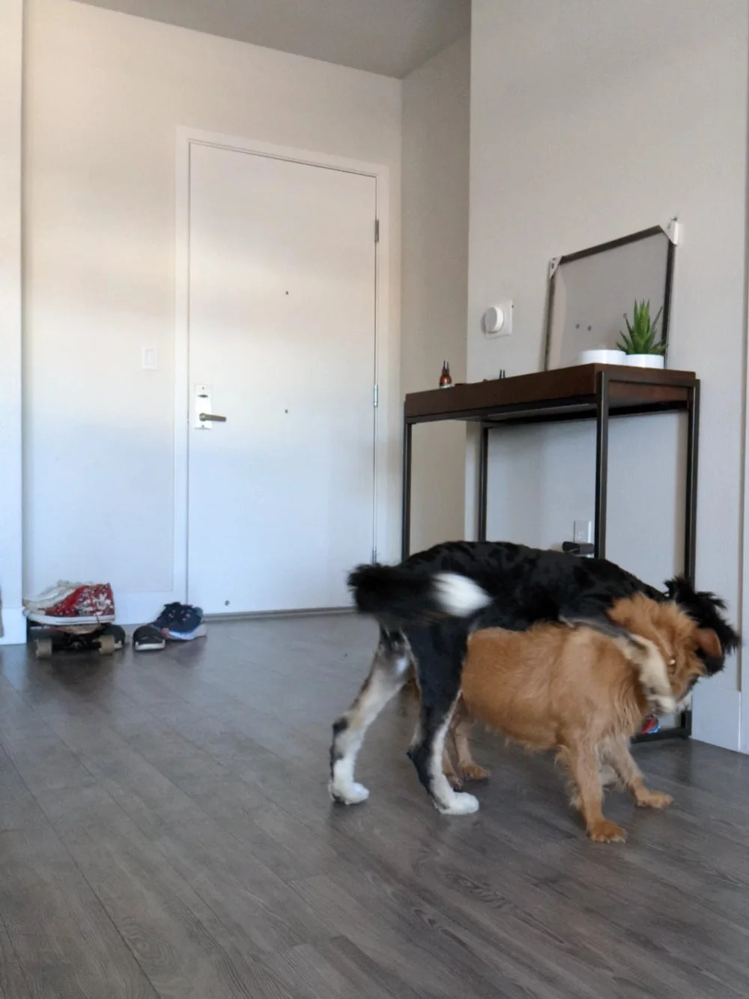
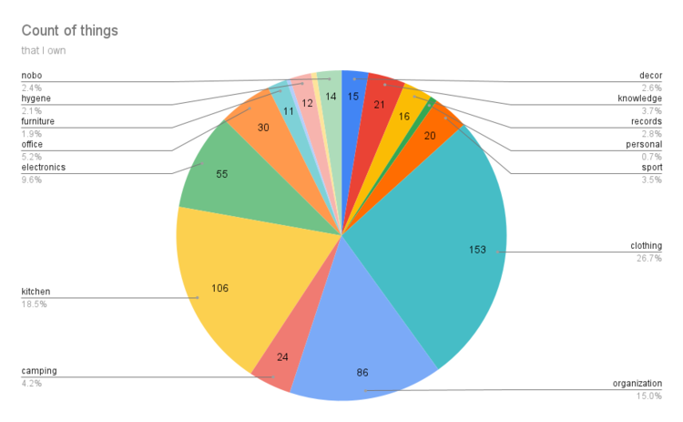

Not to bury the lead and beat around the bush - I own **572** (roughly) things right now.

<!--truncate-->

So let’s rewind and go back to why did I do this. I was planning a move to San Francisco and right before I was starting to pack I came across this [video](https://www.youtube.com/watch?v=BB8o8-EdZY0) where Matt D’avella (kind of a modern-influencer minimalist) counted everything he owned. While I am by no means a minimalist, I do spend a lot of time debating whether I should purchase something or try my best to make things I already own to be as multifunctional as possible. For example, my longboard doubles up as my shoe-rack or just coffee mugs instead of different sizes and shapes for holding different types of liquids.

my dog playing with her friend, the only shot of my longboard shoe-rack

On top of multi-purposing, whenever I want to purchase anything new, I usually write it down on one of several shopping lists I have on my phone and evaluate the need for it by how frequently I try to re-add this item when an instance where I felt like my life would be much easier if I could use that item. Since I have kind of this reduction approach to buying material things, I thought it could also mean I don’t own too many things - so it shouldn’t be too hard to count everything up while I packed. Right?

Ground rules:

* pair of things counted as one thing
* multi-paged documents counted as one thing (like how I would count a book)
* wires used for purposes other than power counted as separate things
* batteries where I have replacements of count as separate things
* consumables - food or products - didn’t count.

Here is the breakdown.

Surprisingly, “clothing” was the largest category at nearly 30% with 153 items. I wasn’t expecting this because I thought I kept quite a lean closet with just basic items that I wear everyday. Also add in the fact that it is sunny all-year around in California I trimmed out most of my wet/cold/hailing/snowing/depressing clothing from Canada.

I was expecting kitchen to be in number one spot because I own a few too many coffee mugs and thought that there is just a minimum number of essential kitchen equipments you need if you are cooking at home regularly.

However, these two categories are probably the least notable to someone who is trying to guesstimate how many things they might own. Because they are often organized away in shelves and take up little space compared to furniture, electronics and decor. While these items do take up more space, I only own a combined 81 items in these three categories. Don’t fall into the trap of underestimating because those are the obvious large items you can easily count.

Was this whole thing a waste of time? Well depends. I might do this every time I move so I can get a sense if I am getting bloated with more items or not. Even if I don’t end up doing that it was still kind of interesting to see how many things you own and really consider how they add to your life.
