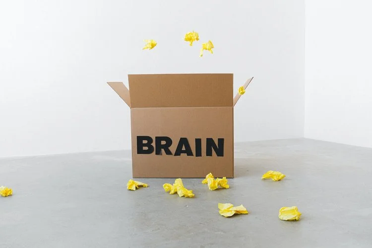
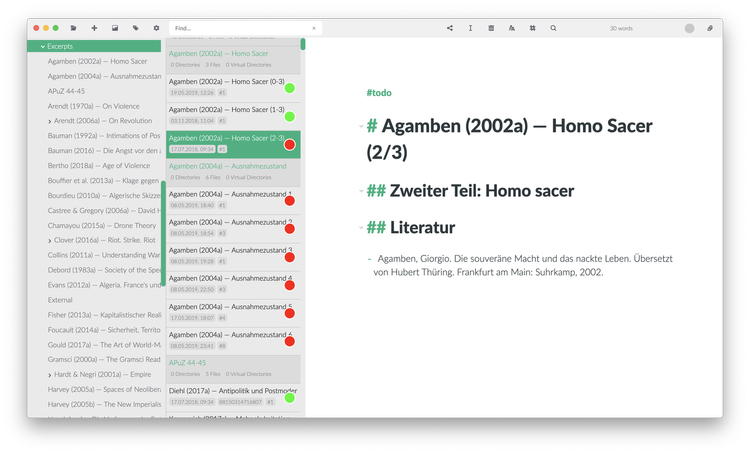
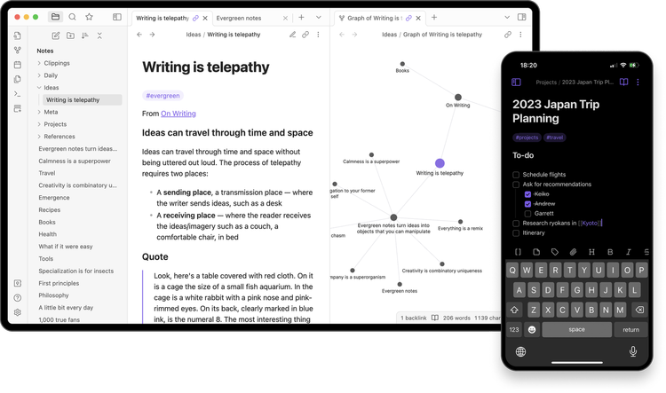
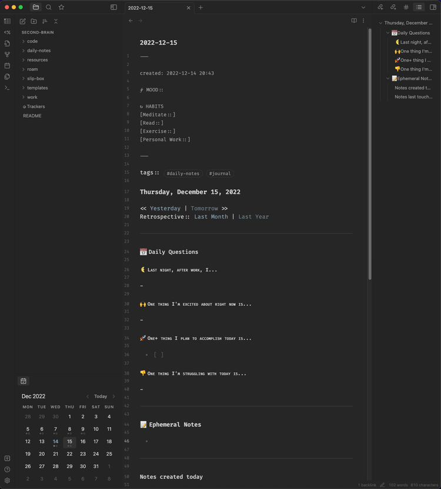

First of all, what is a second brain?



It is a place to store facts and ideas that you learned but may not need on a day-to-day basis. The reason to have a second brain is to keep your primary brain's cognitive activity free of clutter and not be bogged down with remembering numbers, names, and details. It can be focused on the process of understanding and reasoning knowledge.

<!--truncate-->

Being an avid podcast listener, I was also aware that a lot of information just goes in one ear and out the other. The stories, quotes, and ideas from the podcasts were very engaging in the moment and I felt that I was *never* going to forget it. But time and time again, I failed to recall all the details when I want to bring up the story in a conversation.

I needed a way to store and access facts, so I can keep my brain free of clutter to focus on cognitive thinking.

I was researching this one day and found a book called [“How to take Smart Notes"](https://www.soenkeahrens.de/en/takesmartnotes) which describes the process of a slip-box system that was used by Niklas Luhmann to write more prolifically. This note-taking system is a way of organizing thoughts and intermingling ideas to inspire new ones. The emphasis of this system is on the web of connections made between each thought. Also, it encourages you to write small ready-made pieces each time and when you want to write a longer piece - you just have to connect the pieces. This way, the daunting task of writing a full-length piece is broken down into smaller efforts each day.

This method is also known as the Zettelkasten Method which is German for "slip-box", and the original implementation uses index cards. Even though I love nothing more than an analog system, it is probably way too much of a hassle to maintain and update. And, the pain of searching for something is probably not worth the novelty.

So I turned to software.

I initially started with [Zettlr](https://www.zettlr.com/). A decent program that is a markdown editor with bi-directional references and tagging. But I didn't get that "joy" factor when using it, it felt like a tool designed and intended for academic use.



Then I discovered [Roam Research](https://roamresearch.com/) which is an online app that had a strong community behind it. This web app made creating and linking notes extremely easy and the interface was clean to start using without much friction but provided lots of depth for customization. I got into customizing the look and feel of it and had several templates to make daily note entries, book reviews, article summaries, and TIL entries. But I started to feel that the system is doing a good job collecting everything I attempt to write down but doesn't give me a good way to re-organize. I started to feel like it was a messy drawer where I can easily dump notes but was difficult to see how many notes I had and find the right notes at the right time. The web of notes kept growing outwards and they were not strengthening in connection with each other - the promise of generating new ideas was not fulfilled.


In search of this filling of control, I decided to try [Obsidian](https://obsidian.md/). A full-fledged desktop app that looks like a glorified markdown editor, but has lots of small features that make untangling this mess of a web inside my second brain considerably easier.



The first thing I did was export and import all my notes from Roam, and Obsidian has a very helpful markdown importer tool to automatically reformat the syntax from Roam to Obsidian. Then, I reorganize all my existing notes into the `slip-box` folder which is divided like so:

```
slip-box/
├─ reference-notes/
│  ├─ highlights-from-article.md
│  ├─ highlights-from-blog.md
├─ literature-notes/
│  ├─ idea-1-explained-in-my-own-words.md
│  ├─ idea-2-explained-in-my-own-words.md
├─ permanent-notes/
│  ├─ 2a-different-idea-explained.md
│  ├─ 1a-explanation-of-idea.md
│  ├─ 1a1-tangent-from-1a.md
```

Most of the notes I had got dumped into `reference-notes`. There was also a small tree of permanent notes growing that I had forgotten about! It was lost in the woods of Roam and I re-read those and moved them into [permanent-notes]. Then I installed some community plugins to automate my daily notes routine. I used [calendar], [dataview], and [templater] in conjunction with [daily notes] to automagically create a daily note with a habit tracker, journal section, ephemeral notes for brain dumping, and dynamic links to notes I created or touched during the day.

With all this in place, I am starting to feel at home in my second brain.



> Note: Obsidian v1.0.3 on Mac M1 has this long loading time when coming out of hibernation after not using the app for a while. It is a slight annoyance in a world where everything is instantaneous.
