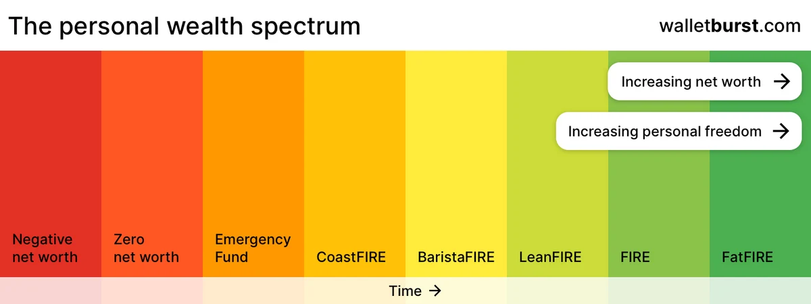
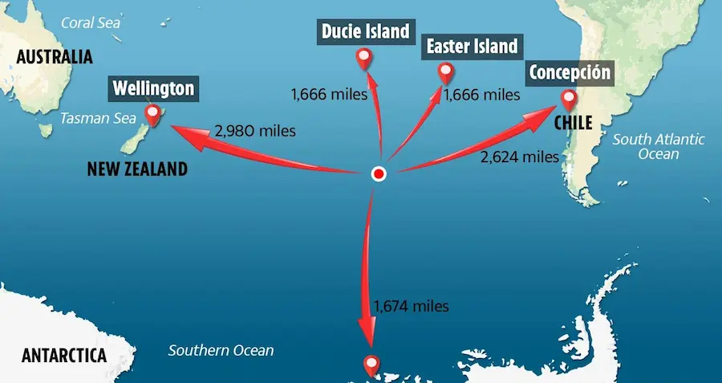
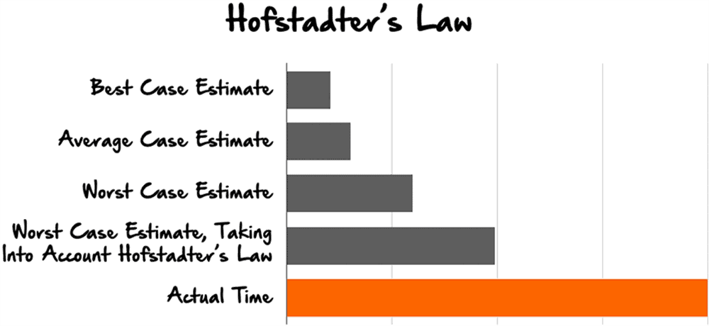
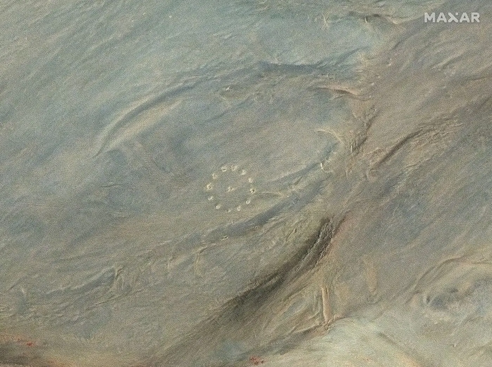
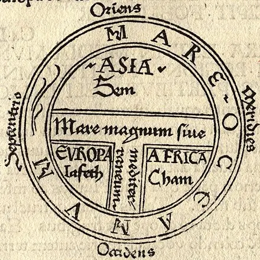

Another year, another TIL. This time I got 55 things.

<!--truncate-->

This is a tradition I started last year to help me recall all the interesting tidbits I come across while surfing the web (why don't people say this anymore?) or listening to podcasts or talking to strangers at parties (sans COVID restrictions).

1. [Jevon's Paradox](https://en.wikipedia.org/wiki/Jevons_paradox)

    * When something is invented to improve efficiency, our logic tells us that it should lead to a reduction in the inputs. But this paradox describes the increased efficiency in using a resource *can actually* lead to the higher usage of said resource and the combined effect is faster depletion of the resource
    * This was observed by economist William Jevons when he noted that the consumption of coal increased after the invention of the Watt steam engine
    * This could be caused by the fact that increased efficiency leads to a decrease in price which can increase demand if the commodity follows an elastic demand curve

2. Flocked Christmas Trees (n.)

    * Christmas trees with fake snow.
    * Flocking is the process of creating texture by attaching tiny fibers to a material. This has been done since the 1800s when they used cotton and flour mixed with glue to create the snowy effect

3. [Barista FIRE vs Coast FIRE

    
    * Two interesting FIRE types that essentially mean you need to have a "barista" (or equivalent) job or "coast" at your job to support the somewhat financially independent lifestyle. So it is in a grey area before completely financially free

4. [Ithkuil](http://www.ithkuil.net/)

    * Known as the most difficult language to learn because it is a constructed language that is a cross between an __a priori philosophical language__ and __a logical language__
    * A priori language means that is not based on any existing languages
    * Philosophical language is designed to reflect some aspect of philosophy
    * Logic language enforces unambiguous statements

5. Gluggaveður (n.)

    * Icelandic word that means "window-weather", the type of weather that is best observed from the cozy and comfort of one's home
    * This warm word describes every fall raining playlist on Spotify but also a kind of mentality to bring when dealing with difficult emotions - try to observe it like you are wrapped up in a soft blanket with a hot tea
    * I wish there is a word like this but for "sweater-weather", the type of weather that is best observed sitting on a bench with a cup of hot coffee

6. [Nerd Snipping](https://xkcd.com/356/)

    * A complex problem that will get the attention of academic or highly technical people regardless if it adds any value
    * Crypto-anything and Web3 might fall under this category since the touted advantages are not yet practical or demonstrated and the cost and inefficiencies of the architecture are impractical to build anything useful. It __currently__ serves as a way to hype cryptocurrency

7. Lede (n.)

    * The opening section of a reporting meant to capture the attention of the audience
    * The intentional misspelling was meant to distinguish it from newspaper editors
    * It was added to the dictionary in 2008

8. [Tu quoque](https://en.wikipedia.org/wiki/Tu_quoque)

    * It means "you also", which is an argument fallacy that discredits another person's point by bringing up an instance where that person has done that exact thing. A specific instance of this is "whataboutism".

9. 'ike (n.)

    * Hawaiian word for knowledge or understand

10. moku (n.)

    * Hawaiian word for island

11. Cocular Implants

    * A type of implant for deaf people that bypasses the ear and uses an electrode to stimulate the brain directly
    * The brain can edit the world in real-time and map new sounds to the expected sounds such that it adapts the new sound to the expectation with amazing speed. It is like machine learning in real-time with active labeling.

12. Chartreuse

    * A french liqueur with a strong herbal taste and it is made by Carthusian Monks following instructions written by Francois Annibal d'Estrees in 1605. named after the monastery "Grande Chartreuse"
    * Today, only two monks at Grande Chartreuse know the secret recipe to the green Chartreuse

13. Starbucks

    * The first mate in Moby Dick
    * One of the generalized words that I have not heard of, unlike kleenex, jacuzzi, frisbees, and band-aids, I didn't know that Starbucks was taken from the book Moby Dick. The brand consultant designed the logo first and saw the name of a town - Starbos and made him think about the first mate on the ship Pequod - Starbuck

14. [Point Nemo](https://oceanservice.noaa.gov/facts/nemo.html)

    
    * The furthest point on Earth from all civilization, in the middle of the Pacific Ocean
    * It is further from humans than the ISS, and it is where programs crash their satellite

15. [Biosphere 2](https://en.wikipedia.org/wiki/Biosphere_2)

    * A 3-acre closed system that mimics Earth to help us research life systems

16. Analog Computing

    * Using voltage and conductance to perform matrix calculations
    * There is an immense application in __deploying__ trained neural networks on analog computers because, at the end of the day, NN is just matrix multiplications.
    * However, the biggest drawback is in the perseverance of the signal, so the more layers the NN has the more impractical it becomes (a solution would be to transfer the analog signal to the digital signal and then send it to the next analog processor)

17. [Bolton Strid](https://allthatsinteresting.com/bolton-strid)

    * A river in Northern England that is considered the most dangerous water system that with a 100% mortality rate
    * Because it is a narrow but incredibly deep body of water. The water is squeezed through a narrow pass that greatly increases the water speed and increases the tribulation

18. Easier to ask for forgiveness than permission (EAFP)

    * The Pythonic way to code
    * There are two coding styles when handling code fails: look before you leap (LBYL) and easier to ask for forgiveness than permission (EAFP)
    * LBYL is when you check for the existence of something before doing something with them
    * While EAFP is to do something and catch the error if it doesn't exist

19. Hofstadter's Law

    > "It always takes longer than you expect, even when you take into account Hofstadter's Law" - Douglas Hofstadter
    
    * Just like how our brain is not suited for compounding effects or exponential effects, we are just not equipped to make time estimates
    * The quote is also a self-referencing quote, which I've never seen. But Douglas Hofstadter seems to enjoy making them

20. Cesca

    
    * A classic icon first designed at the Bauhaus (founded by Walter Gropius) who had the intention of creating utilitarian designs but created wildly expensive handmade crafts.
    * Cesca or B32 was created and embodied the Bauhaus movement and ideal, it didn't require braces and gives it bounce, created by one continuous steel

21. XO (abbr.)

    * "extra-old"
    * XO sauce doesn't have any Hennessy in it, it used that name for the cachet

22. Sahara Desert Circles

    
    * Circle markings in the Sahara Desert in Algeria. This could be a result of seismic surveys used for natural gas extraction

23. 90% of the population lives on 30% of the land in Spain

    * Policy + Natural environment contributes to this trend
    * Lack of investment in the rural areas to connect to the major cities

24. Golf Handicaps

    * Used to compare your performance with other players and also to equalize competition in head-to-head matchups
    * It was used to known as a __hands-on cap__ but later changed to handicap
    * Gauges your skill based on your score compared to a course's par round, so a handicap of 5 means the average score of this player is 5 over par. The lower the handicap the better

25. Neobanks

    * Or known as "challenger banks", which are fintech firms that offer a streamlined version of traditional banking
    * Most well-known neobanks include Chime, Varo, and Revolut

26. [Depeg](https://news.ycombinator.com/item?id=31720277)

    * Currency can be pegged to another by enforcing a fixed exchange rate - which stabilizes the currency and gives confidence for long-term predictability
    * Stablecoins are often pegged to the US dollar
    * Luna crash in May 2022 caused several other networks to also crash which caused Tether (A stablecoin) to be depegged from the US dollar.

27. Time Dilation Equation due to Velocity

    * $$t'=\frac{t}{\sqrt{1-\frac{v^2}{c^2}}}$$
    * Time dilation can be caused by a difference in the relative velocity between them (special relativistic "kinetic" time dilation) or by a difference in gravitational potential between their locations (general relativistic gravitational time dilation)

28. [Wisdom of the crowd](https://en.wikipedia.org/wiki/Wisdom_of_the_crowd)

    * How the collective opinion from a diverse crowd can be eerily accurate - such as guessing the weight of a cow at a fair

29. ["When it rains, it pours"](https://historydaily.org/history-morton-salt-girl-umbrella)

    * It comes from Morton's Salt marketing team, to advertise the fact that their salt is free-flowing even when it is humid out
    * Back before Morton introduced their salt in 1911, salt often clumped together in storage and needed to be de-clumped on rainy days

30. Aliasing

    * When different signals become indistinguishable from each other, this can be caused by sampling inappropriately
    * Or having difficult patterns for the camera sensors like fine stripes
    * Anti-aliasing settings in PC Games are techniques that reduce the jagged edges of the straight lines as a result of down-sampling

31. Hafiz (Hafiza) (pn.)

    * It means the memorizer or guardian, someone who has completely memorized the Quran

32. Sportwashing (n.)

    * When a country uses sports events to mask their problematic political actions
    * Saudi Arabia fund-backed LIV tour, Russia's Olympics, Quartar's world cup.
    * It is related to gastropolitics which is when a country uses cuisine to market the country's reputation

33. Malding

    * mad + balding
    * This is a portmanteau word used by the COD community

34. Montana mandates having the freshest milk

    * Montana's "sell by" date for milk is shorter than any state in the US because it wants to have the "freshest" milk
    * But it just leads to a lot of unnecessary food waste and higher prices

35. Dominant Players

    * Marion Tinsley was the most dominant checkers player that only lost 7 times and twice to Chinook (a checkers program). He was able to see almost 64 moves ahead to find winning positions.
    * Go Seigen is considered the most dominant GO player in the 20th century, his playstyle is very fast and free and was able to make judgments on large positions and win big points
    * Stu Ungar was considered the greatest Texas hold 'em and Gin and Rummy player

36. [Idiocy](https://www.wired.com/story/am-i-an-idiot-for-wanting-a-dumber-phone/)

    * From the greek word __idiotes__ which refers to someone who maintained little connection to the affairs of the state
    * It means "on one's own" or "private". The word __idiosyncratic__ preserved that aspect of the meaning
    * It now purely has a negative connotation but in the past, it was a form of enlightenment - Socrates recognized he knew nothing and claimed that made him wiser than those who believed themselves to be smart

37. [&](https://www.merriam-webster.com/words-at-play/the-history-of-ampersand)

    * The symbol `&` was not always a symbol but a letter - the 27th letter that was a ligature of `e` and `t` which is `et` or `and` in Latin
    * The phrase ampersand came from the fact that there are letters like `I` and `A` that can also function as a word
    * So when you are referring to the use of the letter and not the word, you would use the phrase 'I per se, I", which meant "I by itself, I". When used on the quasi-letter `&`, the phrase becomes "& per se, and" which became "and per se, and" which became "ampersand"

38. Ligature (n.)

    * Something that is used to bind; something that unites or connects

39. [Telescope Rule](https://wiki.c*com/?TelescopeRule)

    * "It is faster to make a four-inch mirror than a six-inch mirror than to make a six-inch mirror" - Programming Pearls
    * The jump to make a larger product is considerable and it is easier to develop the skills needed for a smaller product and iterate to the larger product
    * The parallel to this is in autonomous driving where there are two schools of thought:
    * Iterate autonomous driving from manual driving to fully autonomous - i.e. Tesla
    * Jump directly to fully autonomous driving - i.e. Waymo
    * The rationale for jumping directly to autonomous driving is that it is like building lego from simple structures to complex structures but you can never make the leap to building actual rockets

40. [Sentinel Value](https://artsandculture.google.com/entity/sentinel-value/m097vbz?hl=en) or "Elephant in Cairo"

    * A __special__ placeholder value used in programming like `-1` or `999` to represent termination or `null` values
    * One should be very careful choosing a sentinel value that is unique in form and won't naturally appear in data or algorithm, for this reason, it is also sometimes called "elephant in Cairo"

41. Cellular Network

    * Named thus because the "cellular" network coverage map looked like cells pressed up against each other - "cell" phones

42. Priority (n.)

    * First appeared in the late 14th century to mean "state of being earlier (than something else), prior occurrence or existence"
    * It meant first which is singular, there was no concept of __priorities__
    * Essentialism focuses on this concept and attempts to give people the focus required to achieve the priority in their life

43. Rule of thumb

    * A common belief was that this phrase stemmed from a law that a husband is allowed to beat his wife with a stick no wider than his thumb. However, this law was found to be true. the earliest use of this phrase was back in the 1600s and the origin is still unknown
    * The logo for the video game Fallout has a cartoon character (Vault Boy) with his thumb out and one eye open because he is measuring the stem of the mushroom cloud with his thumb to determine if he needs to start evacuating the area
    * [A paper](https://core.ac.uk/download/pdf/267013666.pdf) on whether this "rule of thumb" is accurate
    * It could stem from the fact that the thumb was a useful way to measure or baseline reference for things

44. [The Ringelmann Effect](https://rnjn.in/articles/the-ringelmann-effect/)

    * As the size of the group increases, the productivity of the individual decreases
    * Why does this happen? The cost of communication increases and people get less motivated because they feel that others will pick up the slack
    * How to prevent this from happening? Need to consciously define specific roles for each person, challenge them with public goals and praise them on their contribution

45. [Carmichael Numbers](https://www.quantamagazine.org/teenager-solves-stubborn-riddle-about-prime-number-look-alikes-20221013/)

    * They are prime-lookalikes that pass Pierre de Fermat's "little theorem" inspired prime test
    * Little theorem - "if N is a prime number, then $b^N -b$ is always a multiple of N"
    * Prime test - the reverse of Little theorem be a test for prime, that by checking $b^N -b$ is a multiple of N for all values of b, then N must be prime
    * The composite numbers that break this prime test are known as Carmichael Numbers and the smallest of such numbers is 561
    * More concretely, the Carmichael Numbers are defined by Korselt's criterion

46. Peto's Paradox

    * At the species level, even though the cancer rate is the same, the chance of finding cancerous cells does not correlate with the number of cells
    * Within the same species, there does seem to be a correlation between the number of cells
    * Could be because to advent the evolution of multicellular species, the larger species have better cancer suppression

47. Idaho Stop

    * Allows cyclists to treat stop signs as yield signs and stop lights as stop signs
    * First passed in Idaho in 1982 and adopted in wider states after Delaware passed it in 2017

48. Gouda

    * Pronounced `hao-da`
    * A small city in the Netherlands with a population of 75,000 that produces this type of cheese

49. Cocktail

    * Horse breeders used to push ginger knobs up the horse's butt when showcasing their horses on the track to cock their tails up. This was believed to be a good indication that the horse had good vigor
    * Mixed drinks were limited to old fashions - spirit + sugar
    * When people had hangovers the next day, they used bitters as a medicinal supplement to suppress nausea and also drank some alcohol as "hair of the dog that bit you" to alleviate the hangover symptoms
    * Soon, bartenders would mix bitters with spirits to create this hangover cure drink that would "cock one's tail"

50. Hair of the dog that bit you
    * Stems from the practice of putting some hair on the wound from the dog that bit you to treat rabies
    * When applied to alcohol, it means to take the same alcohol you had to relieve the hangover

51. Podcast

    * Portmanteau of iPod + Broadcast
    * Coined by The Guardian columnist and BBC journalist Ben Hammersley in February 2004

52. T and O Map

    
    * Also known as *orbis terrarum* or Isidorian map
    * Described the known habitable continents at the time by the 7th-century Spanish scholar

    

    * The T divides the three continents (Europe, Asia, and Africa) by water
    * The T is oriented side-ways with Asia to the right of the Nile and Don
    * Europe and Africa are divided by the Mediterranean Sea

53. Baruch Plan

    * An international organization would be in control of all nuclear product
    * Russia rejected this plan and triggered the nuclear arms race

54. Peace Symbol

    * Created with the combination of the semaphore letters of `N` and `D`, which stands for "nuclear disarmament"

55. [Faint Young Sun Paradox](https://agupubs.onlinelibrary.wiley.com/doi/full/10.1029/2011RG000375)

    * In the Sun's core, hydrogen fuses into helium which produces energy, as the amount of hydrogen decreases, the core shrinks, the fusion rate increases, the Sun gets brighter
    * 4 billion years ago the Sun was too dim to heat water on Earth, but evidence of liquid water on Earth was found
    * Carl Sagan and George Mullen proposed Earth's atmosphere was thicker back then, trapping the heat with carbon dioxide (a greenhouse gas)
