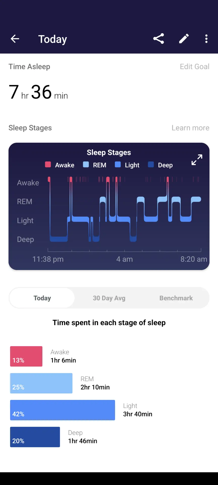
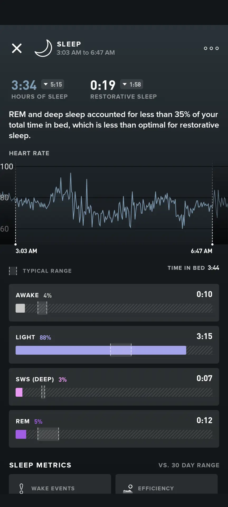
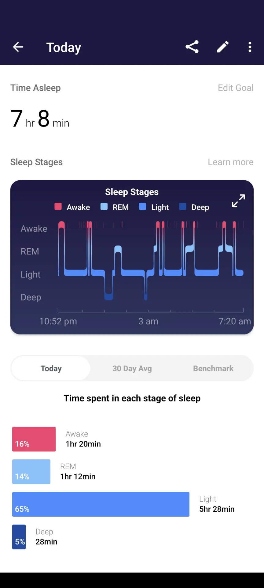
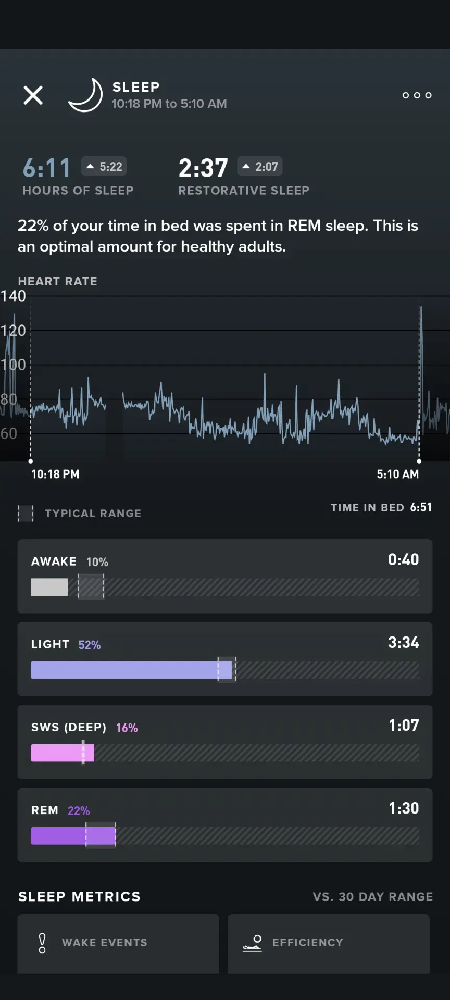
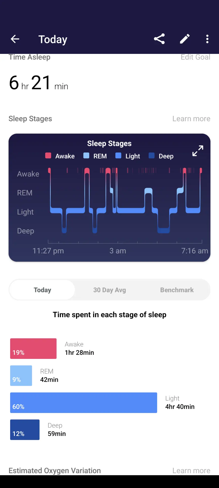
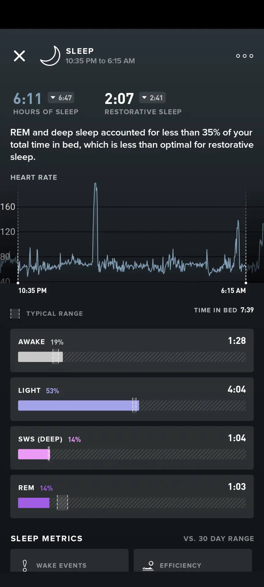

Using FitBit and Whoop to monitor my sleep quality over two weeks from 2021-12-12 to 2021-12-23 and this is what I found

<!--truncate-->

## Context

When I mention that I am looking into how to sleep better, my friends and family first instinct is always "oh are you having trouble sleeping?"
It is not that I have trouble sleeping, it is just that I want to optimize sleep to the absolute maximum.
The importance of good quality sleep is increasingly being understood as the **single most important factor to health**.
Wouldn't I want this to be optimized better than my monster-hunter charge blade build?

The focus of this monitoring is to see which device correlate with my personal experience better so I can start to trust its outputs.

I will wear both devices on each of my wrists and flip halfway through after a week. And note how each night's sleep correlated with how I felt.

## Components

In terms of sleep length:

* FitBit tracked an average of 6.8 hours for both weeks
* Whoop tracked that I slept for an average of 6.5 hours (with 8 hours in bed) in the first week and an average of 5.1 hours (6 hours in bed) for second week

And for sleep quality:

* FitBit tracked a score of 70 for both weeks
* Whoop tracked 71% and 52% performance

## Issues

Why was there a huge discrepancy in the second week?
This leads to the issue I had with Whoop, the sensors are less forgiving if its not worn properly. Some examples of this are:

<table>
 <tr>
  <td> </td>
  <td></td>
  <td>
where we see huge differences!
</td>
 </tr>
 <tr>
 <td> </td>
  <td></td>
  <td>
And cases where we see that even if the total hours is close.
     The allocation of the sleep stages is mismatched.
  
</td>
 </tr>
</table>

<table>
   <tr>
     <td> </td>
     <td></td>
  <td>
There are times where it matched up well.
</td>
 </tr>
</table>

But the problem is that it is very inconsistent.
And beyond this, I don't fully feel correlated with the results tracked by either devices.
More often than not, I feel well rested and did not wake up in the middle of the night as opposed to what the results show me - that I slept very lightly and woke several times.
Although FitBit is more consistent in measuring my sleep, it seems to under-estimate the hours and quality.

From what I have read and learned by speaking to friends in the wearable tech.
The basic hardware technology is identical across the different wearables, and what makes the differences is the algorithm used to determine sleep based on the signals the hardware is sending.
Depending on how the algorithm is tuned, the resulting analysis can vary from device to device.
Maybe Google trained their algorithm on someone who has a lower heart rate or less movement...but it doesn't test well on me.

## Outcome

I will definitely not be switching to Whoop, since it is more expensive and less consistent in tracking sleep for me.
A side note, the strain calculation is pretty spot on, but I never recover enough for it.
Even though, FitBit underestimates my total sleep, I think it does a good job on being consistent in its analysis and I can just do manual adjustments from the baseline.
